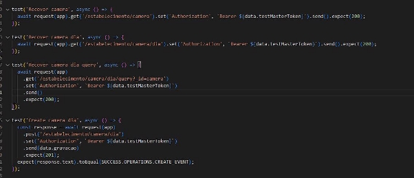

**Atividade - Parte 2**

- **Objeto de requisição next declarado e não utilizado:**

Nesse contexto o next foi declarado, mas não foi utilizado em nenhum momento do código, poderia ser retirado com o intuito de deixar o código mais enxuto.

- **Uso do método getEventByID :**

O método getEventByID está sendo usado aparentemente sem especificar um id, caso alguns dos atributos seja considerado como id, a informação acaba ficando

ambígua e de difícil entendimento.

- **Undefined e true sendo utilizados para verificações dentro de aspas:**

As comparações com undefined e true estão sendo feitas com ambas entres aspas, comumente esses são utilizados para verificação sem o uso de aspas.

**Melhoria:** Realizar a alteração no nome dos parâmetros de comparação para evitar que as comparações confundam no momento da leitura do codigo.

- **Variável não contadora utilizando string:**

A variável count geralmente é tida como uma variável de contagem que incrementa ou decrementa-se com base em números inteiros. O nome count ao ser utilizado com objetivo de realizar verificações que não sejam as de incremento e decremento podem confundir durante a leitura do código.

**Melhoria:** Caso a variável não seja utilizada para realizar contagem, pode-se alterar seu nome para algo menos propício à indução ao erro durante a interpretação do código.

- **Status 204 para retorno de erro:**

O uso do status(204) deve ser utilizado para retornar uma solicitação que foi bem sucedida, no caso apresentado houve uma solicitação de exclusão que não foi concluída, pois o dado solicitado não foi encontrado no banco, gerando assim um erro durante a exclusão, que por sua vez foi mal sucedido.

**Melhoria:** O ideal seria realizar a alteração do status (204) para (400) que indica que um erro ocorreu durante a tentativa de exclusão.

- **Adicionar comentários para facilitar a legibilidade do código:**

Realizar a adição de comentários nas funções, exportações e demais partes relevantes do código pode auxiliar e melhorar o entendimento por parte dos desenvolvedores que terão acesso a ele.

- **Realizar alterações no código a fim de deixar o entendimento mais próximo do produto:**

Por se tratar de uma ferramenta voltada para a gravação de um dia de trabalho em determinado estabelecimento, seria viável realizar a aproximação do código com o produto em questão.

**Melhoria:** Realizar a alteração de nome de variáveis e funções para se aproximar da ideia inicial do produto, podendo por exemplo: alterar a let events para recording, e etc.

- **Padronizar a forma como as strings de atualização são escritas:**

Em algumas partes do código pode se encontrar strings escritas em línguas diferentes como por exemplo: Recover camera dia .

**Melhoria:** Realizar a padronização para deixar toda a string em um único idioma.

- **Especificar no briefing da aplicação, quais os componentes necessários para sua execução:**

Apesar da especificação dos comandos e passos necessários para realizar a instalação da aplicação, alguns componentes extras não especificados são solicitados ao tentar executá-la.

**Melhoria:** Informar no readme do produto quais componentes extras podem ser necessários para a configuração completa da aplicação. Exemplo: express-validator não instalado.

- **Manter um padrão de escrita:**

Em alguns momentos do código algumas strings são escritas em caixa alta sem nenhum motivo aparente.

**Melhoria:** Para uma melhor legibilidade do código, seria recomendado evitar o uso desnecessário de strings em caixa alta, deixando caixa alta apenas para funções e bibliotecas que a exigem.

- **Priorizar a identação do código para melhorar o entendimento:**

Em algumas partes do código é possível perceber que alguns trechos com o mesmo objetivo são indentados de formas distintas, dificultando assim a legibilidade.

**Melhoria:** Manter um padrão de indentação em todo o codigo.

